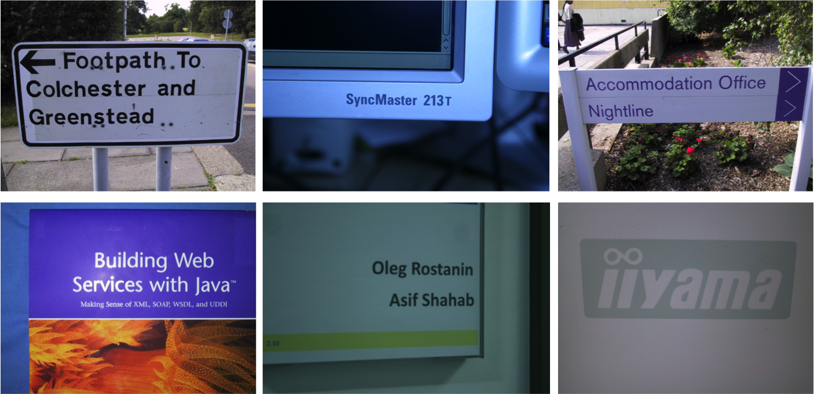
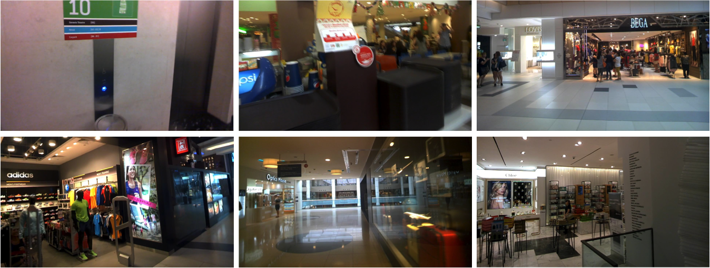
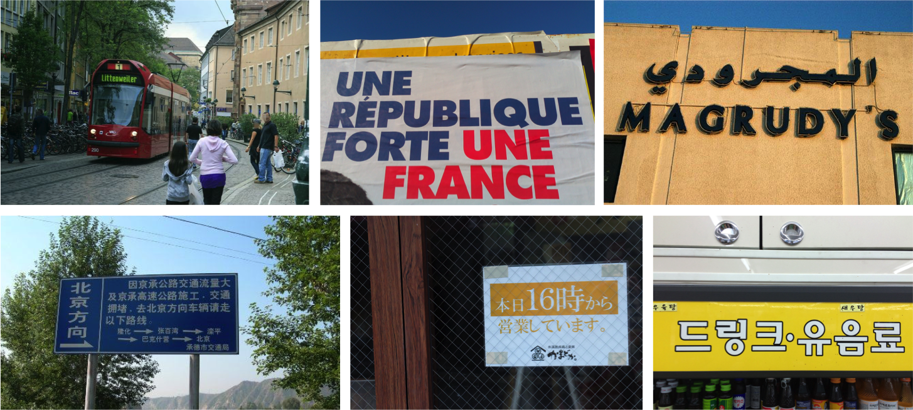

# OCR会议-ICDAR基准数据集

## [`ICDAR 2013 Scene Text`](http://dagdata.cvc.uab.es/icdar2013competition/)

用途：文本检测 识别

ICDAR 2013数据集来源于ICDAR 2013中的Robust Reading Competition，其中包含229张自然场景图片用来训练，233张图片用来测试。这个数据集的文本大多数都是水平的，并且标注方式都是标注字符级别的边框。

## [`ICDAR 2015 Incidental Text`](http://rrc.cvc.uab.es/?ch=4&com=introduction)

用途：文本检测 识别

ICDAR 2015数据集同样来自于ICDAR 2015 Robust Reading Competition，其中包含1000张自然场景图片用来训练，500张图片用来测试。这个数据集来自于谷歌眼镜获取的数据，并且这些数据不是用户刻意去拍摄，而是随机拍摄，背景噪音很大。
这个数据集的标注方式是直接框选整个单词。

## [`ICDAR 2017 COCO-Text`](https://vision.cornell.edu/se3/coco-text-2/)

ICDAR 2017使用[COCO-Text数据集](../SCENE_DATA)

## [`ICDAR 2017 MLT`](http://rrc.cvc.uab.es/?ch=8)

用途：文本检测

ICDAR 2017 MLT数据集用于Multi-lingual scene text detection and script identification，其中包含7200张自然场景图片用来训练，1800张图片用来测试。该数据集由九种语言组成(Chinese, Japanese, Korean, English, French, Arabic, Italian, German and Indian)。

## [`ICDAR 2017 Competition on Reading Chinese Text in the Wild (RCTW)`](http://rctw.vlrlab.net/dataset/)
用途：文本检测,  end-to-end文本识别

数据集由12263张包含中文的自然场景图片组成，其中大部分是直接由摄像头或手机拍摄，少部分为手机屏幕截图，并且每张图像至少包含一行中文。 

数据的标注均通过标注工具手工标注完成，通过绘制四边形来标注一个文本行，而不是以单词为单位进行标注，每个文本行的内容以UTF-8字符串进行标注。在数据集中存在字体、布局和语言等多样性。 

数据集划分为两部分，训练集和验证集包含8034张图片，测试集包含4229张图片。
