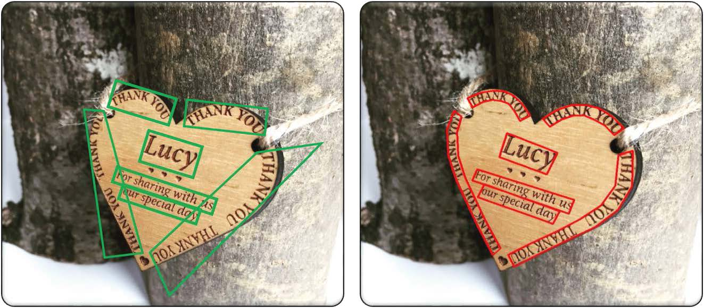
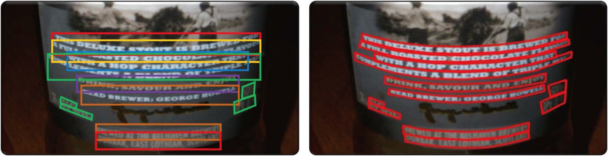
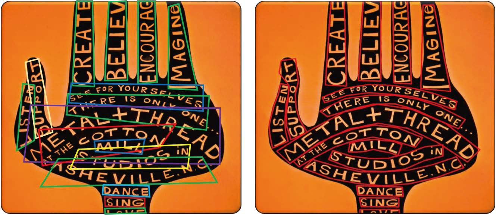
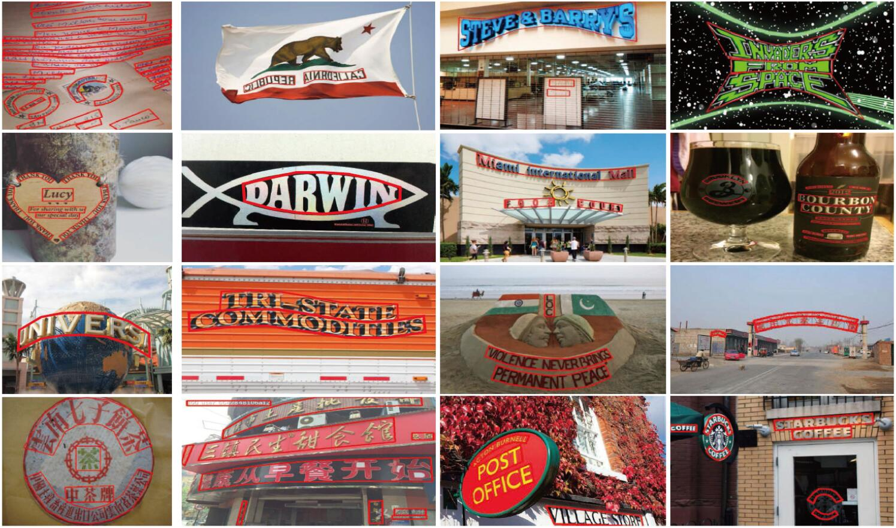
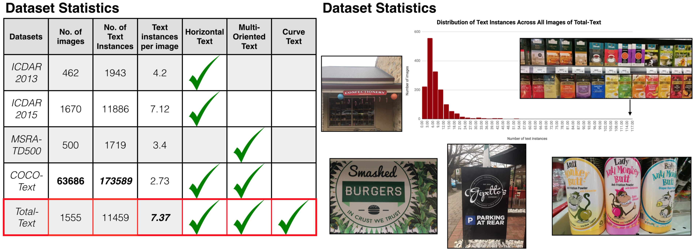

# OCR-不规则数据集

## [`SCUT-CTW1500`](https://github.com/Yuliang-Liu/Curve-Text-Detector) 

用途: 文本检测(不同形状的文本)，识别
[`下载`](https://github.com/Yuliang-Liu/Curve-Text-Detector)

该数据集主要针对自然场景下不同形状的文本检测，比如大多数圆柱体上的文字都是曲线形的，以及硬币、各种各样的logo等等都是弯曲的文本。因此，标注时采用弯曲的边框有三个优势：避免不必要的重叠，更少的背景噪音，以及避免多重文本行交叉，如下图所示。

SCUT-CTW1500总共包含1,500 图片,其中1000张为训练集，500张为测试集，标注实例均为英文或者中文文本。每个图片至少有一行弯曲文本。

## [`Total Text Dataset`](https://github.com/cs-chan/Total-Text-Dataset) 
用途: 文本检测(不同形状的文本)，识别
[`下载`](https://github.com/cs-chan/Total-Text-Dataset)

该数据集同样针对自然场景下不同形状的文本检测，和SCUT-CTW500不同的是全部为英文文本，并且每个图片内的文本方向不保证弯曲，可能为Horizontal，Curved和,Multi-Oriented中的一个。

数据集一共包含1555 图片和11459个文本实例, 每个图片都会标注出其排布曲线。和主流数据集的对比如下图。
