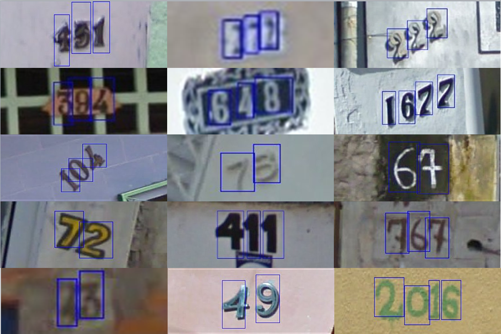

# OCR-自然场景数据集

## [`A Large Chinese Text Dataset in the Wild (CTW)`](https://ctwdataset.github.io/) 

用途: 文本检测，识别
[`下载`](https://ctwdataset.github.io/downloads.html)

该数据集为中文街景数据集，2018年发布，一共32285张高清图片，101万个字符实例，每个汉字都有标注，如图所示。

## [`CASIA-10K`](https://github.com/Jyouhou/SceneTextPapers/blob/master/datasets/CASIA-10K.md) 

用途: 多方向以及多行文本检测
[`下载`](https://pan.baidu.com/s/1oDh7xjj7mFtpPdTxTya1gg?errno=0&errmsg=Auth%20Login%20Sucess&&bduss=&ssnerror=0&traceid=#list/path=%2Fsharelink4116459398-570802694173637%2FCASIA-10K&parentPath=%2Fsharelink4116459398-570802694173637)

该数据集为中文街景数据集，2018年发布，来源于论文Multi-Oriented and Multi-Lingual Scene Text Detection With Direct Regression. He, Wenhao and Zhang, Xu-Yao and Yin, Fei and Liu, Cheng-Lin. 2018 [paper](https://ieeexplore.ieee.org/document/8410577/)
数据集一共10k张图片，7k训练，3k测试。

## [`COCO-Text (Computer Vision Group, Cornell)`](http://vision.cornell.edu/se3/coco-text-2/) 

用途: 文本检测，识别
[`下载`](https://github.com/andreasveit/coco-text)

2016提出的数据库，包括63686幅图像，173589个文本实例，三种细粒度的文本属性。文本实例包括手写版和打印版，清晰版和非清晰版，英文版和非英文版。

数据标注方式为JSON格式，如下图所示。

该数据集为在线使用，通过COCO-API的方式获取图片。参考博客 [关于MSCOCO_text数据集的探索](https://blog.csdn.net/shouhuxianjian/article/details/73178209)
该数据集基于目标检测数据集MSCOCO，使用API参考博客 [MSCOCO数据标注详解](https://blog.csdn.net/wc781708249/article/details/79603522) 

## [`COCO-Text v2.0`](https://bgshih.github.io/cocotext/) 

用途: 文本检测，识别
[`下载`](https://github.com/andreasveit/coco-text)

该数据集为COCO-Text的升级版，同样为63686个图像，文本实例增加到239,506个，且标注更加详细准确，且数据集可以在线查看以及根据id搜索，如下图所示。

## [`MSRA Text Detection 500 Database (MSRA-TD500)`](http://www.iapr-tc11.org/mediawiki/index.php/MSRA_Text_Detection_500_Database_(MSRA-TD500))  

用途: 文本检测

500张自然场景图片 (图片大小从 1296x864 到 1920x1280不等)，为中文英文及其混合的图片。
标注方式如图：

## [`USTB-SV1K`](http://prir.ustb.edu.cn/TexStar/MOMV-text-detection/)   

用途: 文本检测 ，识别

来自USTB Street View，和MSRA-TD500数据集类似。包括1000幅多方向、多视角的图像。每张图像的分辨率是512*512。

每条数据包括一个标注文本和一张原始图片，标注方式如下图。(比MSRA数据集多了文本内容)

## [`Street View Text (SVT)`](http://tc11.cvc.uab.es/datasets/SVT_1)  

用途: 文本检测

所有图像源于Google Street View，图像分辨率较低，文字变化较大。

图像是24位彩色图像，像素大小是1260*860，文件格式为JPEG。包括350幅高分辨率图像，其中100张图像用于训练，250张图像用于测试。
每幅图像都用一个文本向量表示其中包含的文字信息，提供文本区域坐标以及其文本相应的字符。该数据集暂时找不到下载链接。

## [`KAIST Scene_Text Database`](http://www.iapr-tc11.org/mediawiki/index.php/KAIST_Scene_Text_Database) 

用途: 文本检测，识别，分割

包括3000张室内、室外和夜晚的场景图像，所有图片大小均为640*480.
图像中包含韩语、英语（数字）和混合（韩语、英语、数字）的语言。数据集已经分类好了语言和场景，可以分开下载。每条数据包含三项，一项是原始图片：

一项是该图片提取出的文字:

一项是xml类型的标签文本，标注出每个字符的位置和长宽高。

## [`The Street View House Numbers (SVHN)`](http://ufldl.stanford.edu/housenumbers)   
用途: 数字文本位置定位, 数字文字识别
[`下载`](http://ufldl.stanford.edu/housenumbers)

街景数字位置定位与识别数据库。73257张训练图，26032测试图，531131额外功用图。
数据集全部为街景中的数字，分为两种格式，一种是未经处理的原始图像，每个图像内的字符都用框标注了边缘。

另一种是类似MNIST的数据集，每张图片大小为32*32,图片中心为一个数字，大部分图片边缘都对中心字符有干扰。

## [`Natural Environment OCR Dataset (NEOCR)`](http://www.iapr-tc11.org/mediawiki/index.php?title=NEOCR:_Natural_Environment_OCR_Dataset)   
用途: 数字文本位置定为, 数字文字识别
[`下载`](http://ufldl.stanford.edu/housenumbers)

该数据集包括659张自然场景图片以及5238个文本边框标注，数据集包含真实世界中的各种字符。图片中所有文本均被标注。

图片标注数据十分详细，包含来源信息，图片长宽，文本内容包含光学字符，几何以及印刷字符。标注方式如下图。

