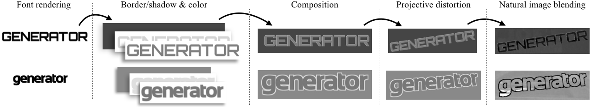
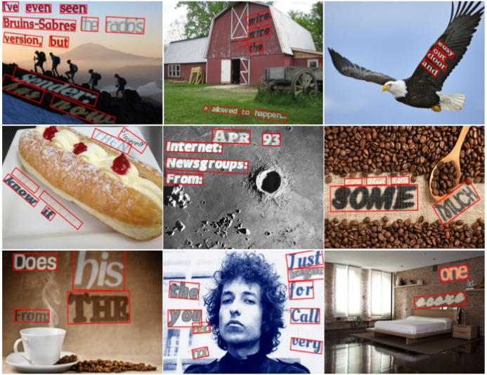

# OCR-人工数据集

## [`Synthetic Word Dataset (Oxford, VGG)`](http://www.robots.ox.ac.uk/~vgg/data/text/) 

用途: 文本识别
[`下载`](http://www.robots.ox.ac.uk/~vgg/data/text/mjsynth.tar.gz)

该数据集一共900万张图像，包括了9万个英文单词，数据集为人工合成图像，涵盖范围广。

## [`Synthetic Data for Text Localisation in Natural Image (VGG)`](https://github.com/ankush-me/SynthText) 

用途: 文本检测，识别
[`下载`](https://github.com/cs-chan/Total-Text-Dataset)

该数据集同样为人工合成，不过比上一个范围更广，它是在各种复杂背景下人工合成的，用来模拟自然场景文本数据，可以清楚的指定文字的标签信息以及位置，不需要人工标注。

该数据集基于论文 ["Synthetic Data for Text Localisation in Natural Images"](http://www.robots.ox.ac.uk/~vgg/data/scenetext/) , Ankush Gupta, Andrea Vedaldi, Andrew Zisserman, CVPR 2016.  论文提供了源码，可以自由生成各种场景下的OCR数据集。不过这些数据更类似于验证码的形式，离真正自然场景还有些距离。

## [`StanfordSynth(Stanford, AI Group)`](http://cs.stanford.edu/people/twangcat/#research) 

用途: 文本识别 
 [`下载`](http://cs.stanford.edu/people/twangcat/ICPR2012_code/syntheticData.tar)

此为人工合成的数据集，包含62个字符的小尺寸图片 (0-9, a-z, A-Z)。总共50000张图片，每张图只包含单字符。