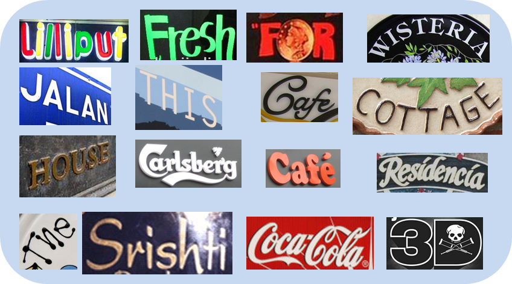
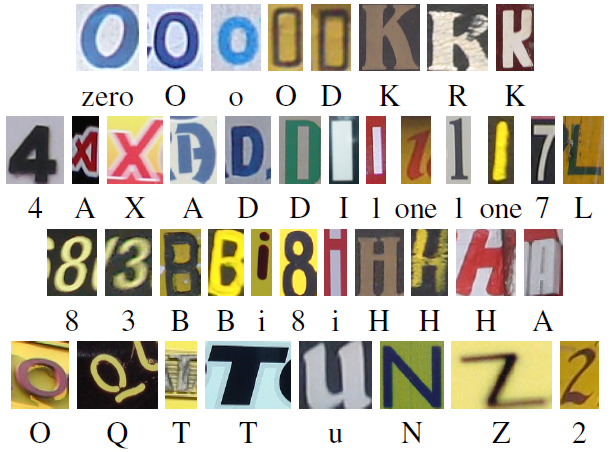

# OCR-单词/字符数据集

## [`The Street View House Numbers (SVHN)`](http://ufldl.stanford.edu/housenumbers)   
用途: 数字文本位置定为, 数字文字识别
[`下载`](http://ufldl.stanford.edu/housenumbers)

街景数字位置定位与识别数据库。73257张训练图，26032测试图，531131额外功用图。
数据集全部为街景中的数字，分为两种格式，一种是未经处理的原始图像，每个图像内的字符都用框标注了边缘。

另一种是类似MNIST的数据集，每张图片大小为32*32,图片中心为一个数字，大部分图片边缘都对中心字符有干扰。

## [`IIIT 5K-Words`](http://cvit.iiit.ac.in/projects/SceneTextUnderstanding/IIIT5K.html)  

用途: 文本识别
[`下载`](http://cvit.iiit.ac.in/projects/SceneTextUnderstanding/IIIT5K-Word_V3.0.tar.gz)

来自谷歌图像搜索，包括5000幅图像，其中2000张用于训练，3000张用于测试。
这些图像中包括了自然场景图像和原生数字图像。图像中包括广告牌、招牌、房屋号码、房屋铭牌和电影海报等内容。数据集分为训练集合测试集。数据集提供50多万个词典单词。

文本图片都被裁剪出来并标记出相应的大小写敏感的文本。

## [`StanfordSynth(Stanford, AI Group)`](http://cs.stanford.edu/people/twangcat/#research) 

用途: 文本识别 
 [`下载`](http://cs.stanford.edu/people/twangcat/ICPR2012_code/syntheticData.tar)

此为人工合成的数据集，包含62个字符的小尺寸图片 (0-9, a-z, A-Z)。总共50000张图片，每张图只包含单字符。

## [`Chars74k`](http://www.ee.surrey.ac.uk/CVSSP/demos/chars74k/) 

用途: 文本识别

Chars74k是一个经典的字符识别数据集，和MNIST类似。主要包括英文字符和坎那达语（kannada）字符。

包括74k幅图像。包括自然场景图像和人工合成的图像，包含通过对称生成的字符图片，每张图只包含少量字符。
英文数据集依据图像采集方式分为三个类别：自然环境下采集的字符图像数据集；手写字符图像数据集；计算机不同字体合成的字符图像数据集。

